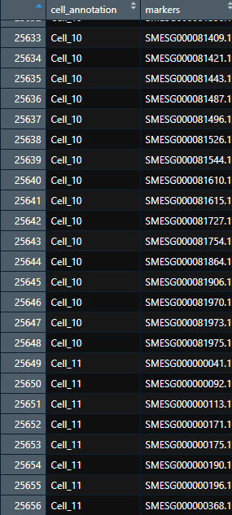

### CellMaNam - Toolkit for Cell Naming based on cell markers

<br />


<p align="right">

</p>


### Author: Jakub Kubiś

<div align="left">
 Institute of Bioorganic Chemistry<br />
 Polish Academy of Sciences<br />
 Laboratory of Single Cell Analyses<br />

<br />

<p align="left">

</p>
</div>


<br />


## Description

A computational tool for naming cell clusters using statistical methods, including Fisher’s exact test and occurrence-based filtering. CellMaNam identifies marker genes and annotates cell types in single-cell RNA sequencing (scRNA-seq) data by analyzing gene occurrence patterns. It systematically determines optimal markers, refines annotations based on hierarchical relationships, and visualizes results through heatmaps, enabling precise and statistically robust cell classification.


#### Installation

```
install.packages("https://github.com/jkubis96/CellMaNam/raw/refs/heads/main/packages/CellMaNam_0.1.0.tar.gz", repos = NULL, type = "source")
```


#### Loading

```
library(CellMaNam)
```


#### Documentation

* [CellMaNam](https://jkubis96.github.io/CellMaNam/index.html)

<br />


#### Example

<br />

##### Load scRNAseq data


```
sc_data_normalized <- read.csv('path_to_saples.csv', row.names = 1)
```

<p align="center">

</p>
</div>

<br />


##### Load markers data
```
markers <- load_markers_data('path_to_markers.[xlsx/tsv/txt/csv]')
```
<p align="center">

</p>
</div>

<br />

##### Calculate markers occurrence & select top unique markers
```
markers_occ <- calc_occurrence(markers_data = markers, features_col = "SMESG", cell_column = 'final_name')

markers_occ <- select_top_occ(markers_occ = markers_occ, top_n = 2)
```

<p align="center">

</p>
</div>

<br />

##### Find markers or load from other source

```
cell_markers <- find_markers_rna_seq(rna_seq_df = sc_data_normalized, exclude_genes = NULL, exclude_mt = TRUE, include_markers = unique(markers_occ$SMESG))
```

If you want to import markers from another source (e.g., Seurat), save the data in the following structure:

<p align="center">

</p>
</div>

<br />

##### Get annotations names to the cell

```
annotations <- get_annotation(cell_markers = cell_markers, markers_occ = markers_occ, max_genes = nrow(sc_data_normalized))
```


<br />

##### Load markers hierarchy data, if required


```
hierarchy_data <- load_markers_hierarchy('path_to_markers_hierarchy.[xlsx/tsv/txt/csv]')
```

<p align="center">

</p>
</div>

<br />

##### Assign primary annotations to the cell and select the top names

```
cell_types <- cell_typing(annotation_data = annotations, hierarchy_data = hierarchy_data, p_val = 0.01, level = 1, hierarchy = TRUE)


cell_types_top5 <- cell_types %>%
  group_by(annotation) %>%
  slice_max(order_by = completed, n = 5) %>%
  ungroup()
```

<p align="center">

</p>
</div>

If hierarchy is not needed, see details in the documentation.


<br />

##### Visualize top names

```
heat_map_names(cell_types_data = cell_types_top5, value = 'completed') 
```

<p align="center">

</p>
</div>

<br />

<br />


#### Have fun JBS©